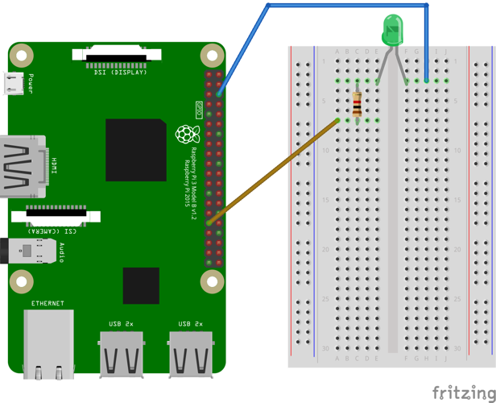

# BlinkThings
A simple Android Things application to get some LEDs blinking

## Getting Started
Follow the directions in [AndroidThings.rocks](https://www.androidthings.rocks) as described in [this article](https://www.androidthings.rocks/2017/01/08/your-first-blinking-led/).

#### Clone this repository
```
git clone git@github.com:mplacona/BlinkThings.git
```
## Connections
Wire up your Raspberry Pi as per instructions. You should end up with something similar to this:



#### Run the application on your device
Open up the application on Android Studio, and click `Run`. You should see the LED starts flashing.
